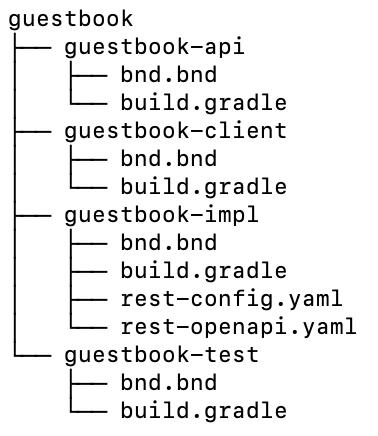

# REST Builder

## Introduction

REST Builder provides an easy way to develop a REST API for your new or existing web services. This services can be invoke through HTTP requests from external systems. Decoupling your service with a REST API gives you flexibility to integrate with different front-end technologies, mobile apps and 3rd party or legacy systems.

## What it is REST Builder?

REST Builder is a code generation tool built by Liferay that allows developers to define custom REST APIs following the [OpenAPI Specification (OAS)](https://www.openapis.org/) in a Design First approach.

Developers can define the API's contract using OpenAPI documents to describe what the API does and what resources handles in a language agnostic and human readable way, allowing both, machines and humans, to understand what the API is supposed to do.

REST Builder generates the API resources model layer and the API implementation layer using the JAX-RS specification, part of the JAVA EE standards. The generation tool implements all the necessary code to access the API defined in the API contract and advanced features as pagination, search, filter, batch support..., and let the developer focus in the service business logic. 

The generation tool also provide a GraphQL endpoint to access your API using the same API definition and with the same advances features as pagination, search, filter..., which make it even more powerful and valuable.

REST Builder can generate an API client implementation to communicate with the REST API and an integration test module to test the API.

## Project Structure

REST Builder tool generate code splitted in multiple modules in order to offer a clean and decoupled implementation of a REST API.

The default project structure is a parent folder with the name of the REST API, usually the artifact identifier, containing a subfolder with the API module, with -api suffix, and a subfolder with the implementation module, with the -impl sufix. If REST API client and integration tests are configured in the REST Configuration file, the parent folder should contain two additional subfolders with -client and -test suffixes, where the client and test code will be generated.

Each module should contain the usual module configuration files: bnd.bnd and build.gradle or pom.xml depending on the desired build mechanism.

Last, the implementation module should include the REST configuration file and OpenAPI documents needed by the generation tool.

The resulting folder structure should be similar to the following:



## Defining the OpenAPI document and REST Configuration file

In this section you'll learn how to configure the REST Builder generation with the REST Configuration file and describe your API using the OpenAPI document (or set of documents).

### REST Configuration file

REST Configuration file allows you to provide required parameters to REST Builder and configuration the resulting generated code.

The REST configuration file has YAML format and should be located inside the implementation module with name "rest-config.yaml" by default.

The configuration parameters are:
| Parameter | Description | Required | Default value |
| --------- | ----------- | :------: | ------------: |
| apiDir    | Directory of the API module | true | |
| apiPackagePath | API package name | true | |
| application | [Application](####application-object) information | true | |
| author | Author | true | |
| clientDir | Directory of the API module | false | |
| clientMavenGroupdId | Group identifier of the client module | false | |
| forcePredictableContentApplicationXML | Force the usage of XML media type in operation request bodies and responses. If no XML definition is provided, JSON definition will be used | false | true |
| generateBatch | Generate batch endpoints | false | true |
| generateGraphQL | Generate GraphQL endpoints | false | true |
| generateREST | Generate REST endpoints | false | true |
| implDir | Directory where the generated code will be stored inside each module | false | src/main/java |
| licenseName | Application license name | false | Apache 2.0 |
| licenseUrl | License URL | false | http://www.apache.org/licenses/LICENSE-2.0.html |
| testDir | Directory of the integration test module | false | |
| warningsEnabled | Enable warnings during the REST Builder execution | false | true |

#### Application object
The Application object parameters are:
| Parameter | Description | Required | Default value |
| --------- | ----------- | :------: | ------------: |
| baseUri    | Application base URI | true | |
| className | Name of the class with the JAX-RS application | true | |
| name | Application name | true | |
| security | [Security](####security-object) information | false | |

#### Security object
The Security object parameters are:
| Parameter | Description | Required | Default value |
| --------- | ----------- | :------: | ------------: |
| basicAuth | Basic authentication | false | |
| guestAllowed | Allow guest access | false | |
| oAuth | oAuth authentication | false | |

An example of a valid REST Configuration file is:
```yaml
apiDir: "../guestbook-api/src/main/java"
apiPackagePath: "com.liferay.guestbook"
application:
    baseURI: "/guestbook"
    className: "GuestbookApplication"
    name: "Guestbook"
author: "John Doe"
clientDir: "../guestbook-client/src/main/java"
testDir: "../guestbook-test/src/testIntegration/java"
```

### OpenAPI Document

The OpenAPI Document describes what the API does and which are the resources to interact with. REST Builder is compatible with the OAS 3.*.* versions and support OpenAPI documents in YAML format.


## Using Blade and Project Templates

[Blade CLI](https://help.liferay.com/hc/en-us/articles/360017880092-Blade-CLI) is a command tool to help creating a new Liferay module. It creates the folder structure and necessary files to kickstart your project, allowing the developer to select between Gradle or Maven build tools.

Blade offers many project templates, including REST Builder.

To create your RESTBuilder project with blade you should execute:
```
blade create --template rest-builder --liferay-version 7.2 guestbook
```

This command will set the REST Builder folder structure, build script files of the selected build tool, and rest-config.yaml and rest-openapi.yaml with basic structure and parameters.

A list of all possible parameters and usage can be found in [Blade CLI](https://help.liferay.com/hc/en-us/articles/360017880092-Blade-CLI) and [Project Templates](https://help.liferay.com/hc/en-us/articles/360018170431-Introduction-to-Project-Templates-) documentation.


## Running REST Builder and understanding generating code

Once you had the folder structure set and the REST Configuration file and OpenAPI documents defined, you can run REST Builder tool to generate the scaffolding for your REST web service. This can be done using Maven and Gradle REST Builder plugins.

### Using Gradle

The REST Builder Gradle plugin lets you execute REST Builder to generate the source files of your REST web service.

To use the REST Builder Gradle plugin you need to include it in your build.gradle file:
```
buildscript {
    dependencies {
        classpath group: "com.liferay", name: "com.liferay.gradle.plugins.rest.builder", version: "1.0.113"
    }

    repositories {
        maven {
            url "https://repository-cdn.liferay.com/nexus/content/groups/public"
        }
    }
}

apply plugin: "com.liferay.portal.tools.rest.builder"

```

The plugin adds the `buildRest` task to your project. This task has two arguments:

| Parameter | Description | Required | Default value |
| --------- | ----------- | :------: | ------------: |
| copyrightFile | File with the Copyright header to be used in the generated code | false | null |
| restConfigDir | Directory containing your REST web service definition files, rest-config.yaml and rest-openapi.yaml. Usually the implementation module folder | false | ${project.projectDir} |

To run the task you need to use the Gradle Wrapper to execute `gradlew buildRest`. The task should finish successfully generating the source files of the configured modules. In case of error, a descriptive message should be provided to allow the developer to easily locate it and fix it.

### Using Maven

REST Builder is also available in Maven with the REST Builder Mavnen plugin.

To use the plugin you need to include it in the project's root pom.xml file:
```xml
<build>
    <plugins>
    ...
        <plugin>
            <groupId>com.liferay</groupId>
            <artifactId>com.liferay.portal.tools.rest.builder</artifactId>
            <version>1.0.113</version>
            <configuration>
            </configuration>
        </plugin>
    ...
    </plugins>
</build>
```

The plugind adds the Maven Goal `build-rest:build` to run the code generation. There are two optional parameters to be added in the configuration section:
| Parameter | Description | Required | Default value |
| --------- | ----------- | :------: | ------------: |
| copyrightFile | File with the Copyright header to be used in the generated code | false | null |
| restConfigDir | Directory containing your REST web service definition files, rest-config.yaml and rest-openapi.yaml. Usually the implementation module folder | false | ${project.projectDir} |

To run the task execute the Maven goal command with `mvn build-rest:build`. The goal should finish generating the source files or with a meaningful error.

### Understanding the generated code


## Implementing REST API

The main entry point to implement your REST API is the *ResourceImpl classes inside the implementation module. This is where you need to add your business logic to be executed when somebody access your REST web service. It is important to remark that you should not add any code inside classes annotated as `@Generated` as this classes will be recreated each time REST Builder is executed. This can be necessary if you need to modify the API definition or to expand it.

If test module is configured you should also add the correspondent code to test your logic.

Once you finished you can deploy your REST webservice and use it in the URL:
```
http://[host]:[port]/o/[APPLICATION_NAME]/[API_VERSION]/
```

To be sure your REST webservice is correctly deployed you can use the OSGi console to list all the JAX-RS endpoints with the command `jaxrs:check`